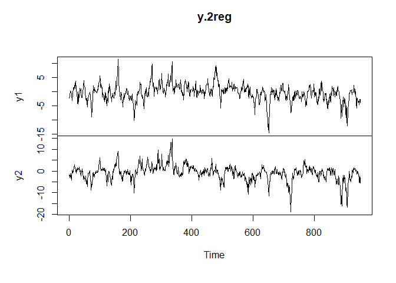

<!-- README.md is generated from README.Rmd. Please edit that file -->

# vstar

<!-- badges: start -->
<!-- badges: end -->

The goal of vstar is to test and estimate Vector Smooth Transition
Autoregression models (VSTAR). The code is based on the specification
from (Teräsvirta 1994).

(Teräsvirta 1994) describes the most general model, allowing for
different transition variables and threshold values for every equation
of the system and every regime. However, in the package implemented is
much simpler, yet suitable specification, which uses a common transition
variable for all regimes and a common threshold value in each regime.

## Installation

You can install the development version of vstar from
[GitHub](https://github.com/) with:

``` r
# install.packages("devtools")
devtools::install_github("vadim-zyamalov/vstar")
```

## Example

This is a basic example which shows you how to solve a common problem:

``` r
library(vstar)
```

Let’s generate an artifical data with two regimes using the following
matrices: The transition variable is a normal random variable with zero
mean and unit variance. The threshold value is a median value of the
transition variable. The smoothness parameter $\gamma$ equals 4. We’ll
use a logistic transition function.



First, we prepare data for the LSTAR-model estimation:

``` r
model.2reg <- vstar.prepare(endo = c("y1", "y2"),
                            p = 1,
                            trans = s,
                            dataset = y.2reg)
```

The linearity test statistics reject the null of linearity:

``` r
round(linearity.test(model.2reg, J = 1), 4)
#>                     stat crit.10 crit.5  crit.1 p.value
#> LM              861.1741  7.7794 9.4877 13.2767       0
#> r-LM            214.3861  1.9478 2.3766  3.3291       0
#> Rao             463.2582  1.9478 2.3766  3.3291       0
#> Bartlett-Wilks 1291.7807  7.7794 9.4877 13.2767       0
```

Next, we obtain the starting values for Nonlinear Least Squares by the
grid search.

``` r
result.2reg <- vstar.grid(dataset = model.2reg,
                          m = 2,
                          gamma.limits = c(3, 5),
                          points = 200,
                          cores = 10)
```

The we estimate the model with NLS.

``` r
result.nls.2reg <- vstar.nls(result.2reg, tol = 1e-6, verbose = TRUE)
#> Step 1: delta = 0.00174813
#> Step 2: delta = 0
#> Tolerance level 1e-06 achieved in 2 steps.
```

Then we print out the summary of the estimated model.

``` r
summary(result.nls.2reg)
#> Results of L-VSTAR model estimation
#>
#> Number of regimes:      2
#> Number of lags:         1
#> Number of observations: 949
#> Endogenous variables:
#>  y1 y2
#> Transition variable:    custom
#>
#> Additional model components:
#> Constant included:               FALSE
#> Trend included:                  FALSE
#>
#> Transition function: logistic
#> gamma values:
#> [1] 4.134393
#> threshold values:
#> [1] 0.04981291
#>
#> Matrix of coefficients:
#>              R1.y1        R1.y2     R2.y1     R2.y2
#> l1.y1  0.496116782 -0.006628721 0.7837311 0.1105947
#> l1.y2 -0.006861645  0.509762292 0.1290430 0.7811628
#>
#> Matrix of coefficients SD:
#>            R1.y1      R1.y2      R2.y1      R2.y2
#> l1.y1 0.01727355 0.01721476 0.02607322 0.02598448
#> l1.y2 0.01526715 0.01521518 0.02235490 0.02227881
#>
#> Residuals covariance matrix:
#>             resid.y1    resid.y2
#> resid.y1  1.00476572 -0.06233943
#> resid.y2 -0.06233943  0.99793755
```

# References

<div id="refs" class="references csl-bib-body hanging-indent">

<div id="ref-terasvirta1994specification" class="csl-entry">

Teräsvirta, Timo. 1994. “Specification, Estimation, and Evaluation of
Smooth Transition Autoregressive Models.” *Journal of the American
Statistical Association* 89 (425): 208–18.
<https://doi.org/10.2307/2291217>.

</div>

</div>
